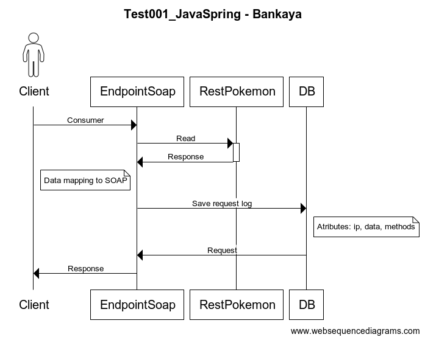

# README #

This README would normally document whatever steps are necessary to get your application up and running.

### What is this repository for? ###

Quick summary



* This is a evaluation challenge for a level junior, middle o senior backend.**

This project follows the API pattern and is split in 2 modules:**

* ***endpointsoap***
  This is the module read of rest, api base from create wsdl, endpoint de soap and save register.

* ***generate-clases_from_wsdl***

This is the module where we create the class of a wsdl.

### How do I get set up? ###

* Prerequisites
    * Java 11
    * [Soap UI](https://www.soapui.org/downloads/soapui/)
    * Internet connection

* Summary of local set up
    * run `mvn clean install`
        * This will create the `challenge/endpointsoap/target/endpoint-0.0.1-SNAPSHOT.jar` file.


* Configuration
    * In the [`application.properties`]( endpointsoap/src/main/resources/application.properties) file, you can override
      the default configuration.


* Dependencies
    * Dependencies are managed by Maven in the parent [`pom.xml`](pom.xml). All versions are defined here, so that child
      modules use the same versions and thus avoiding potential conflicts.
    * Spring Web for the endpoints
    * Spring Boot for autoconfiguration

* Database configuration
    * H2


* Application building

    * We use Maven as our build tool. Here is
      the [Maven Build Lifecycle](https://maven.apache.org/guides/introduction/introduction-to-the-lifecycle.html) for
      reference.

Maven goals commonly used in this project:

| Goals                               | Description                                                                                                                                                                                |
| ----------------------------------- | ------------------------------------------------------------------------------------------------------------------------------------------------------------------------------------------ |
| `clean`                             | Removes all files generated by the previous build. Recommended to run first, before any build goal.                                                                                        |
| `sonar`                             | Executes Sonar Qube analysis. Recommended to run after a build goal.                                                                                                                       |
| `versions:display-property-updates` | Scans the project and produces a report of those properties which are used to control artifact versions and which properties have newer versions available. Recommended to run standalone. |
| `compile`                           | Build goal to compile source code.                                                                                                                                                         |
| `test`                              | `compile` plus compile and run tests.                                                                                                                                                      |
| `package`                           | `test` plus package compiled code into a jar.                                                                                                                                              |
| `install`                           | `package` plus install in local maven repo for other local projects to reuse.                                                                                                              |

Sample maven command goal runs:

* `mvn clean test sonar`
* `mvn clean install`
* `mvn versions:display-property-updates`

* How to run tests
    * Execute mvn clean install
    * Execute the class com/challenge/endpointsoap/EndpointsoapApplicationTests.java (port 8080. For further
      information, see challenge/endpointsoap/src/main/resources/application.properties)

* How to validate operation?
    * Open file challenge/generate-clases_from_wsdl/src/main/resources/service.wsdl in Soap UI.
    * Execute SOAP methods (validate request).

* How to validate the log database?
    * Access the console at the following [http://localhost:8080/h2-console/](http://localhost:8080/h2-console/). You
      need to enter the JDBC URL (For
      further
      information, see challenge/endpointsoap/src/main/resources/application.properties)
    * Take a look at the data added by the 'challenge' application. Run the following SQL command:

``````````
SELECT * FROM LOGSERVICE 
``````````
